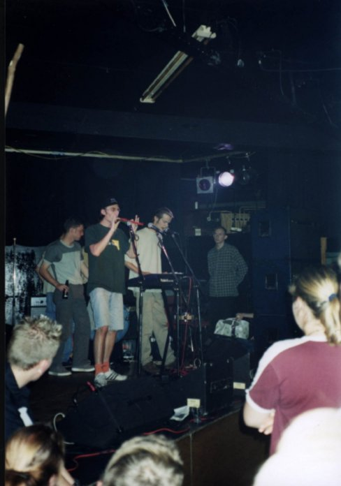

# CD #1: Debut CD of 'Het Bilderbeek, Bilderbeek & Bogaart Bogaart Quartet'

Branch|
---|---
master|

The debug album of 'The Bilderbeek Bilderbeek & Bogaart Bogaart Quartet',
recorded in 'Het Prinsentheater'.

 * Download the booklet of the BB&BBQ debut album: [pdf](Quartet.pdf), [odt](Quartet.odt) 

#|Title|OGG|MP3
---|---|---|---
01|Ode Aan Masculiniteit (vocaal)|[here](CD01_01OdeAanMasculiniteitVocaal.ogg)|[here](CD01_01OdeAanMasculiniteitVocaal.mp3)
02|Maanliedje|[here](CD01_02Maanliedje.ogg)|[here](CD01_02Maanliedje.mp3)
03|Het Koffielied|[here](CD01_03HetKoffielied.ogg)|[here](CD01_03HetKoffielied.mp3)
04|Grote Gele Sinaasappel|[here](CD01_04GroteGeleSinaasappel.ogg)|[here](CD01_04GroteGeleSinaasappel.mp3)
05|Ode Aan Masculiniteit|[here](CD01_05OdeAanMasculiniteit.ogg)|[here](CD01_05OdeAanMasculiniteit.mp3)
06|Maanliedje (remix)|[here](CD01_06MaanliedjeDisco.ogg)|[here](CD01_06MaanliedjeDisco.mp3)
07|Het Koffielied (remix)|[here](CD01_07HetKoffieliedDisco.ogg)|[here](CD01_07HetKoffieliedDisco.mp3)
08|Grote Gele Sinaasappel (remix)|[here](CD01_08GroteGeleSinaasappelDisco.ogg)|[here](CD01_08GroteGeleSinaasappelDisco.mp3)
09|Ode Aan Masculiniteit (remix)|[here](CD01_09OdeAanMasculiniteitDisco.ogg)|[here](CD01_09OdeAanMasculiniteitDisco.mp3)
10|Hendrik (vocaal)|[here](CD01_10Hendriklied.ogg)|[here](CD01_10Hendriklied.mp3)

## External links

 * [Richel Bilderbeek's music](https://github.com/richelbilderbeek/music)
